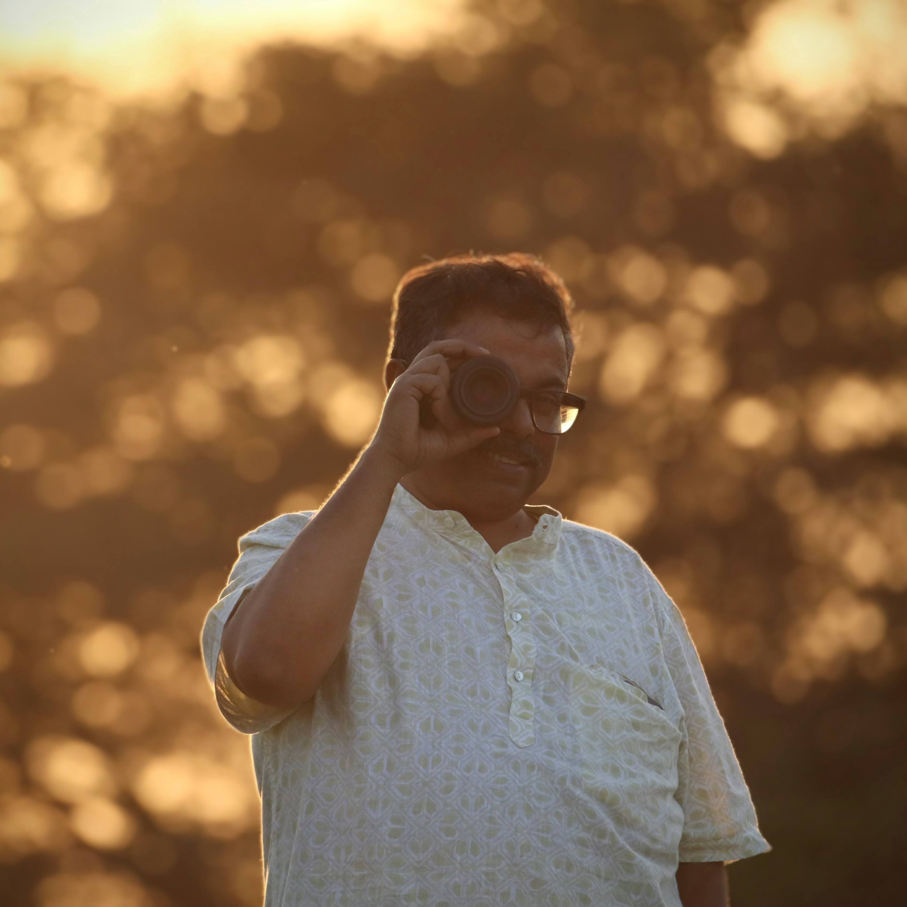

:::: {.home-layout}

::: {.home-sidebar}

{.profile-photo}

### Academic

**Associate Professor**  
[Department of Physics](https://physics.iitgn.ac.in/)  
[Indian Institute of Technology Gandhinagar](https://iitgn.ac.in/)

### LIGO

[Senior Member, LIGO Scientific Collaboration](https://www.ligo.org/)

[LSC Council Member](https://ligo.org/organization/)

### Links

[Email](mailto:asengupta@iitgn.ac.in)  
[INSPIRE-HEP](https://inspirehep.net/authors/1040066)  
[Selected Publications](https://inspirehep.net/literature?sort=mostrecent&q=find%20a%20Sengupta%2C%20Anand%20S.%20and%20ac%201-%3E20)  
[Google Scholar](https://scholar.google.com/citations?hl=en&user=nqD2hsYAAAAJ&sortby=pubdate)  
[ORCID](https://orcid.org/0000-0002-3212-0475)  
[GitHub](https://github.com/asengupta74)

:::

::: {.home-main}

## Associate Professor of Physics

Indian Institute of Technology Gandhinagar

I work in gravitational-wave physics, with interests in gravitational-wave
data analysis, Bayesian parameter estimation, template-bank construction,
tests of general relativity, and next-generation gravitational-wave detectors.

My research focuses on methods for extracting astrophysical and
fundamental-physics information from gravitational-wave observations,
particularly for compact binaries and future detector networks.

I have been continuously associated with the LIGO Scientific Collaboration
since 2001, initially as a student member and, since 2010, as a Senior Member.
My early work in the collaboration included compact-binary searches and
contributions to the
[LIGO Algorithm Library (LAL)](https://git.ligo.org/lscsoft/lalsuite/-/tree/master/lal)
and
[LALApps](https://git.ligo.org/lscsoft/lalsuite/-/tree/master/lalapps)
software infrastructure. I was part of what was then the Inspiral Upper
Limits Group (IUL Group), which subsequently evolved into the Compact Binary
Coalescence (CBC) Group. I currently serve as an LSC Council Member and am a Senior Member of the
LIGO Scientific Collaboration.

## Research

Current themes include:

- **Fast gravitational-wave inference**
- **Long-duration signals in third-generation detectors**
- **Template banks and search methods**
- **Tests of general relativity**
- **Neutron-star equation-of-state inference**

A more detailed overview is available on the [Research](research.html) page.

## Research Notes

Short writeups on recent work are collected under
[Research Notes](posts/indigo-d/index.html).

Recent topics include:

- [Breaking the long-signal barrier in gravitational-wave inference](posts/long-signal-barrier/index.html)
- [Low-discrepancy sequences for gravitational-wave template banks](posts/low-discrepancy-template-banks/index.html)
- [Making Bayesian gravitational-wave inference faster](posts/fast-bayesian-inference/index.html)

## Publications

My complete publication list is available on
[INSPIRE-HEP](https://inspirehep.net/authors/1040066).

:::

::::

