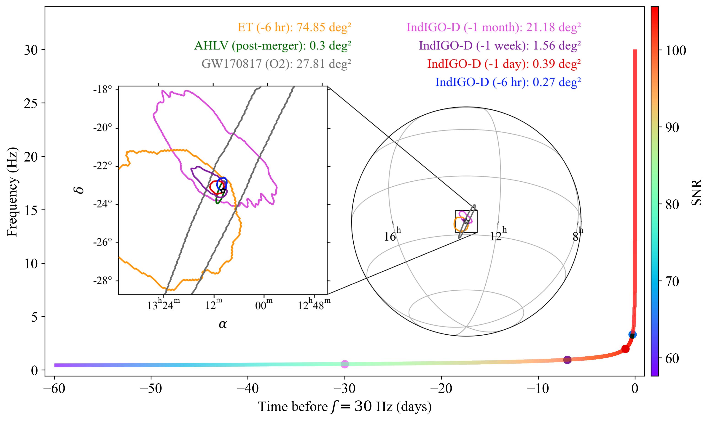

**Paper:** [Probing Compact Binary Coalescences in the Decihertz GW Band with IndIGO-D](https://arxiv.org/abs/2601.06956)

There is a large observational gap between the millihertz band targeted by
LISA and the frequencies accessible to terrestrial gravitational-wave
detectors. The decihertz band, roughly \(0.1\)--\(10\) Hz, is especially
interesting because many compact binaries pass through it shortly before
entering the ground-based detector band.

A stellar-mass binary observed by LISA may still be years away from merger.
The same class of system observed in the decihertz band can instead be
followed during the final months, days and hours before coalescence.

## The IndIGO-D concept

IndIGO-D is a decihertz gravitational-wave observatory concept being studied
within the IndIGO community.

In our work we consider one particular realization: three spacecraft in
heliocentric orbit forming an L-shaped Michelson interferometer. Two
orthogonal arms, each \(1000\,\mathrm{km}\) long, meet at a common vertex,
making the geometry conceptually similar to a terrestrial L-shaped
interferometer, but placed in space.

{width=70% fig-align="center"}

*Illustration of the heliocentric motion of the three-spacecraft IndIGO-D
configuration considered in our study.*

Our study is not a complete mission-design or technological-feasibility
study. We take the heliocentric L-shaped geometry and an assumed detector
sensitivity as inputs, calculate its time- and frequency-dependent
gravitational-wave response, and ask what compact-binary astrophysics such
an instrument could enable.

The orbital motion is important. Compact binaries can remain observable for
months or years, during which the detector changes both its position and
orientation. This produces amplitude, phase and Doppler modulations that
carry information about the source direction.

## Bridging gravitational-wave bands

For the sensitivity assumed in our study, a GW170817-like binary neutron
star system is observable with IndIGO-D out to a horizon redshift of about
$z \sim 0.3$.

Such systems would later enter the band of terrestrial detectors, providing
multiband observations of the same binary.

The same frequency range also gives access to binaries containing
intermediate-mass black holes. Systems with total masses around
$10^2$--$10^3\,M_\odot$ occupy a region where a decihertz detector
complements both LISA and terrestrial observatories.

## Early warning

For me, one of the most interesting aspects of the study is the possibility
of obtaining useful sky localization well before a neutron-star merger.

For a simulated GW170817-like binary, using three months of IndIGO-D data,
we obtain the following 90% sky-localization areas:

| Time before merger | 90% sky area |
| :--- | ---: |
| 1 month | $21.18\,\mathrm{deg}^2$ |
| 1 week | $1.56\,\mathrm{deg}^2$ |
| 1 day | $0.39\,\mathrm{deg}^2$ |
| 6 hours | $0.27\,\mathrm{deg}^2$ |

The improvement comes from accumulating a long stretch of inspiral while
the orbital motion of the detector continuously modulates the signal.

{width=90% fig-align="center"}

*Sky localization of a GW170817-like binary at different pre-merger epochs.
The time-frequency track is coloured by the accumulated signal-to-noise
ratio. IndIGO-D localizes the source to about $21\,\mathrm{deg}^2$ one
month before merger, $1.6\,\mathrm{deg}^2$ one week before merger, and
below $0.3\,\mathrm{deg}^2$ six hours before merger.*

A localization of order a square degree a week before merger changes the
character of electromagnetic follow-up. Rather than reacting only after the
gravitational-wave event, wide-field telescopes can know where to look while
the binary is still approaching merger.

For comparison, in the configuration studied in the paper, the same source
observed with the Einstein Telescope is localized to roughly
$75\,\mathrm{deg}^2$ six hours before merger.

## Other science in the decihertz band

The long low-frequency inspiral is also useful for physics that can become
progressively harder to measure as binaries approach merger. Examples
include residual orbital eccentricity and weak environmental effects such
as perturbations from dense dark-matter distributions around
intermediate-mass black holes.

These effects may be small instantaneously but can accumulate over the very
large number of orbital cycles observed in the decihertz band.

For the adopted sensitivity and population assumptions, we estimate a
binary-neutron-star detection rate of roughly

$$
76\text{--}767\ \mathrm{yr}^{-1}.
$$

The range is dominated by the uncertainty in the local BNS merger rate.

## The broader point

The attraction of the decihertz band is that it connects different parts of
gravitational-wave astronomy.

LISA probes the slow, early evolution of many compact binaries.
Ground-based detectors observe their final inspiral and merger. A decihertz
observatory occupies the region in between, where binaries evolve rapidly
enough to provide practical early warnings but slowly enough to accumulate
months of precise phase and directional information.

IndIGO-D is one possible realization of such an observatory. Our study is
primarily an exploration of the astrophysics that becomes possible if the
required sensitivity can be achieved.
