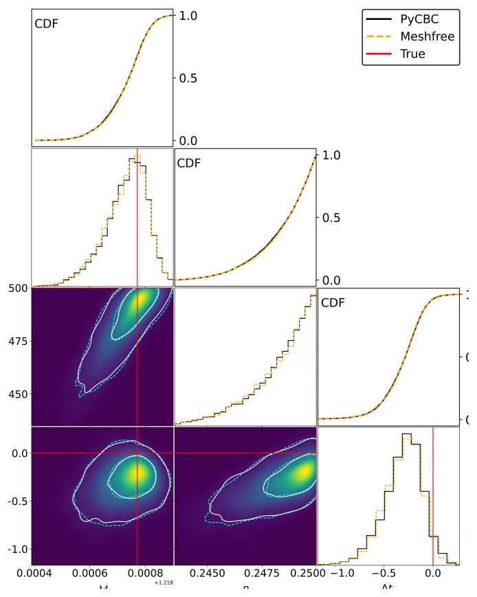
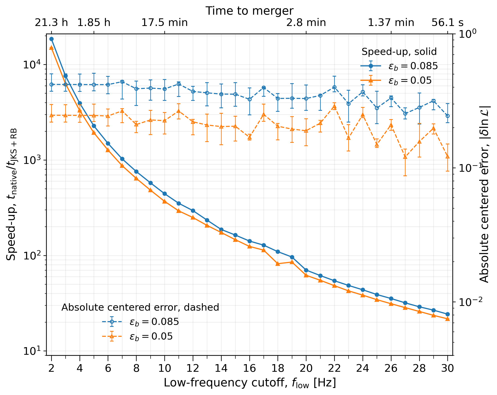
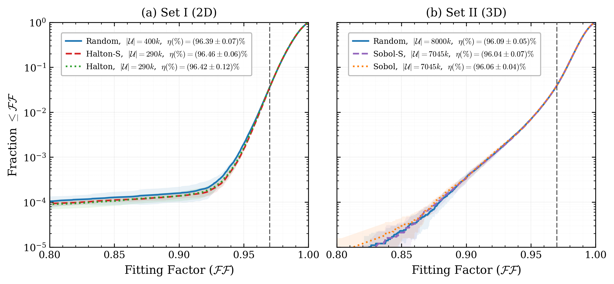
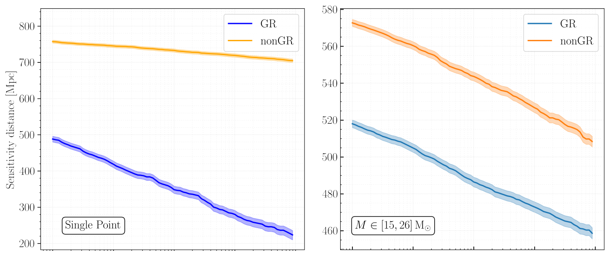
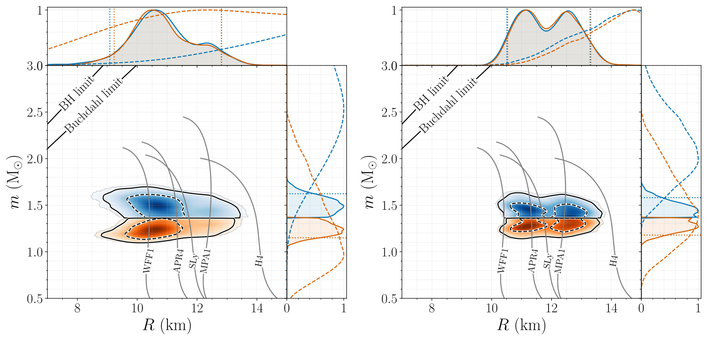

My research is in gravitational-wave physics, with an emphasis on methods for
detecting and interpreting compact-binary signals. A recurring theme is how to
preserve the physical structure of the waveform and detector response while
making searches and Bayesian inference computationally tractable. Much of my
current work is motivated by the long signals, large detector networks, and
higher event rates expected in next-generation gravitational-wave observatories.

## <i class="bi bi-speedometer2 research-icon"></i> Fast gravitational-wave inference

::: {.research-theme}

::: {.research-copy}
Bayesian parameter estimation for compact binaries is computationally expensive,
particularly for long-duration signals and large detector networks. I develop
methods that reduce the cost of likelihood evaluation while retaining the
relevant structure of the waveform and detector response.

Current work includes relative binning, reduced frequency representations,
meshfree interpolation, and fast-likelihood methods designed for present and
next-generation detectors.
:::

::: {.research-figure}
{fig-alt="Comparison of binary-neutron-star posteriors obtained using meshfree likelihood interpolation and direct PyCBC inference"}

Meshfree likelihood interpolation reproduces the posterior obtained from direct likelihood evaluation.

:::

:::

## <i class="bi bi-globe2 research-icon"></i> Long-duration signals and next-generation detectors

::: {.research-theme .research-theme-reverse}

::: {.research-copy}
Binary neutron-star signals can remain in third-generation detectors for hours.
Over these timescales, the rotation of the Earth changes the detector response
appreciably and cannot be treated as a small correction.

I am interested in exploiting the resulting sidereal structure rather than
treating it simply as an additional numerical complication. This includes fast
parameter estimation, sky localization, and the role of future detector
networks involving LIGO-India, Einstein Telescope, and Cosmic Explorer.
:::

::: {.research-figure}
{fig-alt="Computational speed-up for likelihood evaluation of long-duration gravitational-wave signals"}

Fast likelihood evaluation for long-duration signals in third-generation detectors.

:::

:::

## <i class="bi bi-grid-3x3-gap research-icon"></i> Searches and template banks

::: {.research-theme}

::: {.research-copy}
Matched-filter searches for compact binaries require discrete template banks
that cover high-dimensional waveform parameter spaces efficiently.

My work in this area includes stochastic and geometric template placement,
methods based on the waveform metric, and the use of low-discrepancy sequences
such as Sobol and Halton sequences to improve the efficiency and uniformity of
template-bank construction.
:::

::: {.research-figure}
{fig-alt="Cumulative fitting-factor distributions for stochastic gravitational-wave template banks constructed using random, Sobol, and Halton sampling"}

Template-bank coverage obtained with random and low-discrepancy proposal sequences.

:::

:::

## <i class="bi bi-bezier2 research-icon"></i> Tests of general relativity

::: {.research-theme .research-theme-reverse}

::: {.research-copy}
Gravitational-wave observations provide direct tests of the dynamics of
strong-field gravity.

I work on parameterized tests of general relativity using compact-binary
signals, including search and inference methods that allow small departures
from general-relativistic waveforms while retaining computationally efficient
likelihood evaluation.
:::

::: {.research-figure}
{fig-alt="Sensitive distance as a function of inverse false-alarm rate for GR and non-GR gravitational-wave template banks"}

Search sensitivity to signals with parameterized departures from general relativity.

:::

:::

## <i class="bi bi-stars research-icon"></i> Neutron-star physics

::: {.research-theme}

::: {.research-copy}
Binary neutron-star observations constrain tidal interactions and the equation
of state of dense nuclear matter.

I am interested in hierarchical inference of neutron-star equation-of-state
parameters from populations of binary-neutron-star observations, including how
the available information accumulates across events and depends on the
underlying source population.
:::

::: {.research-figure}
[{fig-alt="Mass-radius posterior constraints for the neutron stars in GW170817 with representative equations of state"}](https://arxiv.org/abs/1805.11581)

Mass–radius constraints from GW170817. Figure from the
[LIGO Scientific Collaboration and Virgo Collaboration, *Phys. Rev. Lett.* **121**, 161101 (2018)](https://arxiv.org/abs/1805.11581).

:::

:::

## Publications

A complete list of publications is available on
[INSPIRE-HEP](https://inspirehep.net/authors/1040066).
